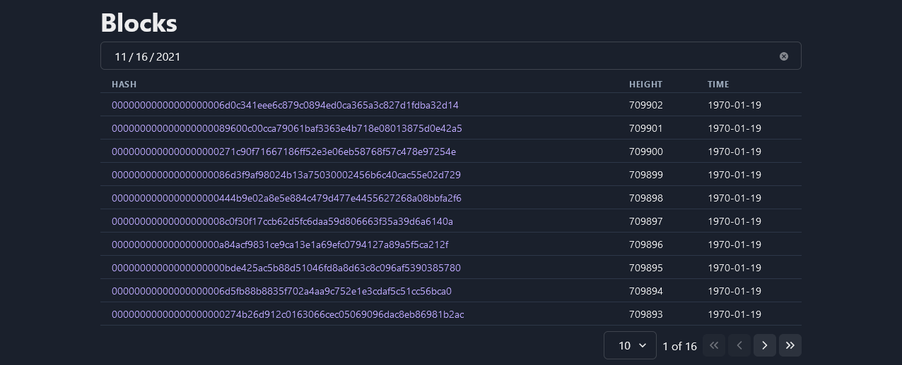

# blockchain-explorer ₿

[](https://github.com/facebook/jest)
[](https://cypress.io)
[](https://github.com/prettier/prettier)

Blockchain information for blocks & transactions.



## Getting started

```
git clone https://github.com/malcodeman/blockchain-explorer.git blockchain-explorer
cd blockchain-explorer
yarn install && yarn dev
```

## Testing

Project contains both unit(`jest`) and e2e(`cypress`) tests.

```
"test": "jest --watch",
"test:ci": "jest --ci",
"cypress": "cypress open",
"cypress:ci": " cypress run --headless"
```
